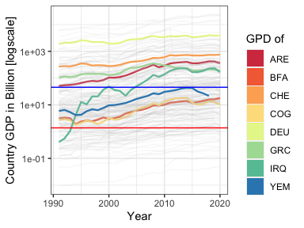
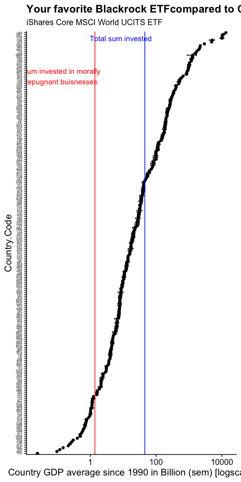
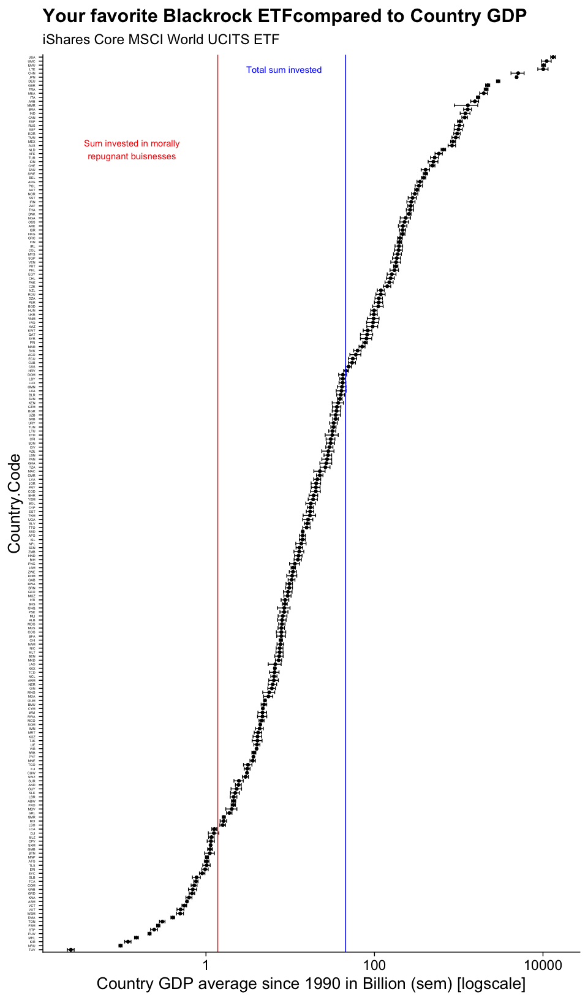

How Bad is it really
================
Simon
1/9/2022

# About

In this document i explore how much the capital in one of the most
popular MSCI world ETF is Specificially i try to get some scale on
Blackrocks’ iShares Core MSCI World UCITS ETF. All information is taken
form Blackrocks’ [self
disclosure](https://www.ishares.com/de/privatanleger/de/produkte/251882/ishares-msci-world-ucits-etf-acc-fund).
According to their website the iShares Core MSCI World UCITS has a
capital of 47055706319,35 USD. 0.52% is invested in companies, that
produce controversial weapons such as landmines or fragmentation
grenades. while 0.52% does not sound like much it still amounts to 0.236
Billion USD. 0.50% are invested in nuclear weapons, 2.3527853^{8} USD.
In total, the iShares Core MSCI World UCITS invests 1.382 Billion
dollars in morally repugnant buisnesses.

## Compare the MSCI world to Country GDP.

As i have no idea how much 47055706319 USD really is, we need a scale to
comprehend these numbers, so i downloaded a dataset that contains [all
contries’ GDPs](https://data.worldbank.org/indicator/NY.GDP.MKTP.CD) and
visually relate them the capital of the ETF. This file contains
summaries as well, i clean them.

``` r
Code_breaks=GDP$Country.Code%>%unique()
Colors=rep("grey",length(Code_breaks))
Size=rep(0.5,length(Code_breaks))
Alphas=rep(0.1,length(Code_breaks))

ColourContries=c("ARE","BFA","COG","CHE","DEU","GRC","IRQ","YEM")%>%sort()#which Contries do you want to highlight?
  
Highlights=brewer.pal(n=length(ColourContries),name="Spectral")
Colors[which(Code_breaks %in% ColourContries)]=Highlights

legend<-cowplot::get_legend(ggplot(data.frame(ColourContries),aes(x=ColourContries,fill=ColourContries))+
  geom_bar()+scale_fill_manual(name="GPD of",breaks=ColourContries,values=Highlights)
)

#make highlight vectors
Colors[which(Code_breaks %in% ColourContries)]=Highlights
Size[which(Code_breaks %in% ColourContries)]=0.8
Alphas[which(Code_breaks %in% ColourContries)]=1

GDPPlot<-GDP%>%filter(Year>1990)%>%
  ggplot(aes(x=Year,y=GDP))+
  geom_line(aes(color=Country.Code,alpha=Country.Code,size=Country.Code))+
  geom_hline(yintercept=Anlagesumme/10^9,color="blue")+
  geom_hline(yintercept=total/10^9,color="red")+
  scale_y_log10("Country GDP in Billion [logscale]")+
  scale_color_manual(breaks=Code_breaks,values = Colors)+
  scale_size_manual(breaks=Code_breaks,values = Size)+
  scale_alpha_manual(breaks=Code_breaks,values = Alphas)+
  theme_bw()+
  theme(legend.position="none")
```

``` r
plot_grid(GDPPlot,legend, rel_widths = c(1,0.3))
```

    ## Warning: Removed 512 row(s) containing missing values (geom_path).

<!-- -->

``` r
GDP%>%filter(Year>1990)%>%group_by(Country.Code)%>%
  summarize(mGDP=mean(GDP,na.rm=T),
            sem=sd(GDP,na.rm=T)/sqrt(n()))%>%filter(!is.na(mGDP))->GDP2

    #arrange(mGDP)%>%
GDP2$Country.Code=factor(GDP2$Country.Code,levels=GDP2$Country.Code[order(GDP2$mGDP)])
```

# 

``` r
GDP2%>%
  ggplot(aes(y=Country.Code,x=mGDP))+
  geom_point()+
  geom_errorbarh(aes(xmin=mGDP-sem,xmax=mGDP+sem))+
  scale_x_log10(name="Country GDP average since 1990 in Billion (sem) [logscale]")+
  geom_vline(xintercept=Anlagesumme/10^9,color="blue")+
  geom_vline(xintercept=total/10^9,color="red")+
  annotate(geom = "text", x = Anlagesumme/10^9-37, y=220, label="Total sum invested",color="blue")+
  annotate(geom = "text", x = (total/10^9)-1.25,y=200, label="Sum invested in morally\nrepugnant buisnesses",color="red")+
  ggtitle("Your favorite Blackrock ETFcompared to Country GDP",subtitle="iShares Core MSCI World UCITS ETF")+
  theme_cowplot(20)+
  theme(axis.text.y=element_text(size=4))
```

<!-- -->

``` r
#ggsave("fun.png",width = 7,height=10)
```

# A nicer y axis

Its better to show percentrank

``` r
GDP2%>%arrange(mGDP)%>%
  mutate(percent=percent_rank(mGDP))%>%
  ggplot(aes(y=percent,x=mGDP))+
  geom_point()+
  geom_errorbarh(aes(xmin=mGDP-sem,xmax=mGDP+sem))+
  scale_x_log10(name="Country GDP average since 1990 in Billion (sem) [logscale]")+
  scale_y_continuous(name="Percent Rank Countries")+
  geom_vline(xintercept=Anlagesumme/10^9,color="blue")+
  geom_vline(xintercept=total/10^9,color="red")+
  annotate(geom = "text", x = Anlagesumme/10^9-37, y=0.8, label="Total sum invested",color="blue")+
  annotate(geom = "text", x = (total/10^9)-1.25,y=0.8, label="Sum invested in morally\nrepugnant buisnesses",color="red")+
  ggtitle("Your favorite Blackrock ETFcompared to Country GDP",subtitle="iShares Core MSCI World UCITS ETF")+
  theme_minimal(14)
```

<!-- -->

``` r
  #theme(axis.text.y=element_text(siz))
```
