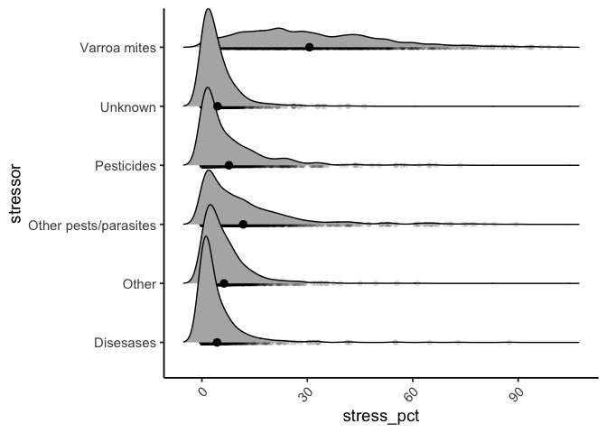
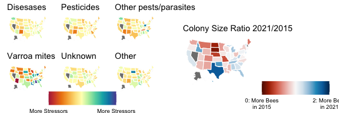

TidyTueseday Week 2
================
Simon
1/11/2022

## Bees

Are they really Dying? What does the data look like?

``` r
tuesdata <- tidytuesdayR::tt_load('2022-01-11')# aha seems to be two different datasets
```

    ## --- Compiling #TidyTuesday Information for 2022-01-11 ----

    ## --- There are 2 files available ---

    ## --- Starting Download ---

    ## 
    ##  Downloading file 1 of 2: `colony.csv`
    ##  Downloading file 2 of 2: `stressor.csv`

    ## --- Download complete ---

``` r
tuesdata$colony
```

    ## # A tibble: 1,222 x 10
    ##     year months       state      colony_n colony_max colony_lost colony_lost_pct
    ##    <dbl> <chr>        <chr>         <dbl>      <dbl>       <dbl>           <dbl>
    ##  1  2015 January-Mar… Alabama        7000       7000        1800              26
    ##  2  2015 January-Mar… Arizona       35000      35000        4600              13
    ##  3  2015 January-Mar… Arkansas      13000      14000        1500              11
    ##  4  2015 January-Mar… California  1440000    1690000      255000              15
    ##  5  2015 January-Mar… Colorado       3500      12500        1500              12
    ##  6  2015 January-Mar… Connectic…     3900       3900         870              22
    ##  7  2015 January-Mar… Florida      305000     315000       42000              13
    ##  8  2015 January-Mar… Georgia      104000     105000       14500              14
    ##  9  2015 January-Mar… Hawaii        10500      10500         380               4
    ## 10  2015 January-Mar… Idaho         81000      88000        3700               4
    ## # … with 1,212 more rows, and 3 more variables: colony_added <dbl>,
    ## #   colony_reno <dbl>, colony_reno_pct <dbl>

``` r
tuesdata$stressor
```

    ## # A tibble: 7,332 x 5
    ##     year months        state   stressor              stress_pct
    ##    <dbl> <chr>         <chr>   <chr>                      <dbl>
    ##  1  2015 January-March Alabama Varroa mites                10  
    ##  2  2015 January-March Alabama Other pests/parasites        5.4
    ##  3  2015 January-March Alabama Disesases                   NA  
    ##  4  2015 January-March Alabama Pesticides                   2.2
    ##  5  2015 January-March Alabama Other                        9.1
    ##  6  2015 January-March Alabama Unknown                      9.4
    ##  7  2015 January-March Arizona Varroa mites                26.9
    ##  8  2015 January-March Arizona Other pests/parasites       20.5
    ##  9  2015 January-March Arizona Disesases                    0.1
    ## 10  2015 January-March Arizona Pesticides                  NA  
    ## # … with 7,322 more rows

## What doe the stressors look like

    ## Picking joint bandwidth of 1.76

    ## Warning: Removed 843 rows containing non-finite values (stat_density_ridges).

    ## Warning: Removed 843 rows containing non-finite values (stat_summary).

    ## Warning: Removed 843 rows containing missing values (geom_point).

<!-- --> # There
is more info Here i take the difference in stressors By US federal state

``` r
#plots<-list()

  
plots1<-tuesdata$stressor%>%
  mutate(stress_pct=case_when(is.na(stress_pct)~0,
                              T~stress_pct))%>%
  pivot_wider(names_from=year,values_from=stress_pct)%>%
  group_by(stressor,state)%>%
  dplyr::summarize(M_Stress_pct2021=mean(`2021`,na.rm=T),
                   M_Stress_pct2015=mean(`2015`,na.rm=T))%>%rowwise()%>%
  mutate(diffS=M_Stress_pct2021-M_Stress_pct2015)%>%ungroup%>%
  mutate(min=min(diffS),#for limits
         max=max(diffS))%>%
  split(.$stressor)%>%
  map(~plot_usmap(data=.x, values = "diffS", color = "white") + 
  scale_fill_continuous_divergingx(name = "", 
                                   limits=c(unique(.x$min),unique(.x$max)),mid=0,palette = "Spectral",
                                   breaks=c(unique(.x$min),unique(.x$max)),
                                   labels = c("More Stressors\nin 2015", "More Stressors\nin 2021")) + 
  #facet_wrap(stressor)+
  theme(legend.position = "bottom")+
  ggtitle(unique(.x$stressor))
  )
```

    ## `summarise()` has grouped output by 'stressor'. You can override using the `.groups` argument.

``` r
Stressors<-cowplot::plot_grid(plots1[[1]]+theme(legend.position = "none"), 
                   plots1[[4]]+theme(legend.position = "none"),
                   plots1[[3]]+theme(legend.position = "none"),
                   plots1[[6]]+theme(legend.position = "none"),
                   plots1[[5]]+theme(legend.position = "none"),
                   plots1[[2]]+theme(legend.position = "none"),
                   NULL,get_legend(plots1[[2]]),NULL,
                   #rel_widths = c(1,1,1,1,1,1,0.3),
                   rel_heights = c(1,1,0.3),nrow=3)
```

# Where did bees disappear

And now i take the Bee ration between 2021 and 2015.

``` r
Ratio<-tuesdata$colony%>%
  pivot_wider(names_from=year,values_from=colony_n)%>%
  group_by(state)%>%
  dplyr::summarize(M_Stress_pct2021=mean(`2021`,na.rm=T),
                   M_Stress_pct2015=mean(`2015`,na.rm=T))%>%rowwise()%>%
  mutate(diffS=M_Stress_pct2021/M_Stress_pct2015)%>%ungroup%>%
  plot_usmap(data=., values = "diffS", color = "white") + 
  scale_fill_continuous_divergingx(name = "", 
                                   limits=c(0,2),mid=1,palette = "RdBu",
                                   breaks=c(0,2),
                                   labels = c("0: More Bees\nin 2015", "2: More Bees\nin 2021")) + 
  #facet_wrap(stressor)+
  theme(legend.position = "bottom",legend.justification = c(-1.5,0))+
  ggtitle("Colony Size Ratio 2021/2015")
```

# join

``` r
RatioLegend<-plot_grid(Ratio+theme(legend.position="none"),get_legend(Ratio),ncol=2)
plot_grid(Stressors,NULL,RatioLegend,rel_widths = c(1,0.1,1),nrow=1)
```

<!-- -->
